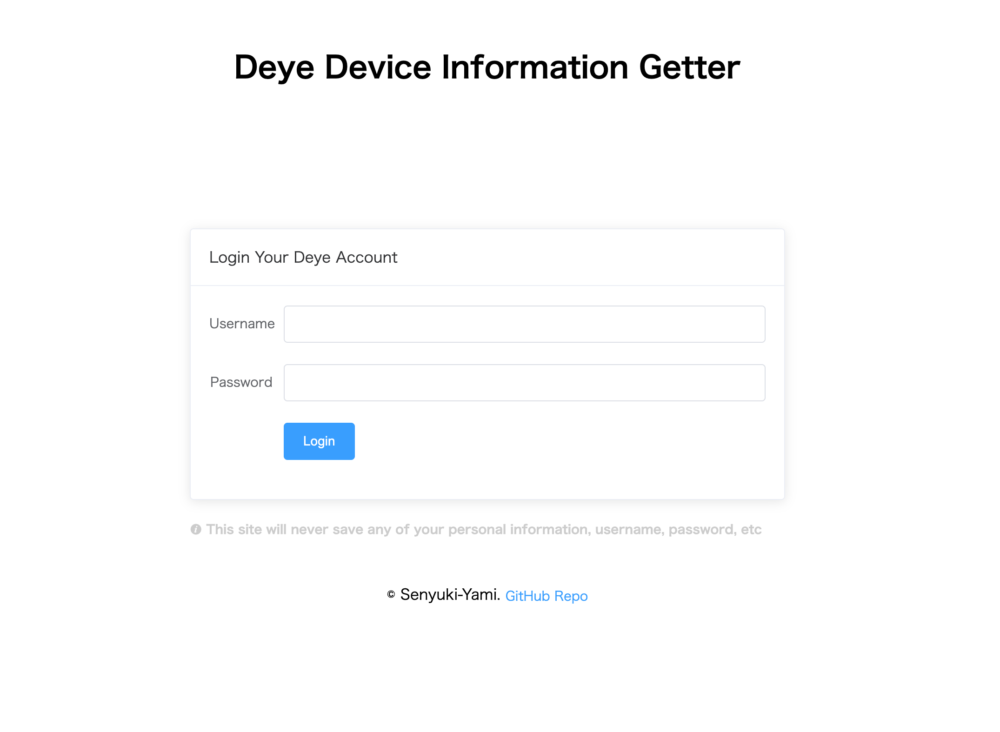

# Deye Device Information Getter

Link Address: [https://yamisenyuki.github.io/Deye-Device-Information-Getter/](https://yamisenyuki.github.io/Deye-Device-Information-Getter/)

## What this repo can do
You can log in to your Deye account through this website, which will help you access all the device information in your account for accessing platforms such as [Homebrige](https://github.com/homebridge/homebridge), [Home Assistant](https://github.com/home-assistant/core), [Node-RED](https://github.com/node-red), etc.

## ⚠️ Cautions
Since Deye accounts can only be logged into one device, your Deye app may be logged out. Just get the information you need and log back into the app.

## Screenshot

## Homebrige Plugin
* [homebridge-deye](https://github.com/IcesandSora/homebridge-deye)

## Special Thanks
* Vue - [https://github.com/vuejs/vue](https://github.com/vuejs/vue)
* Element - [https://github.com/ElemeFE/element](https://github.com/ElemeFE/element)
* axios - [https://github.com/axios/axios](https://github.com/axios/axios)
* superagent - [https://github.com/visionmedia/superagent](https://github.com/visionmedia/superagent)